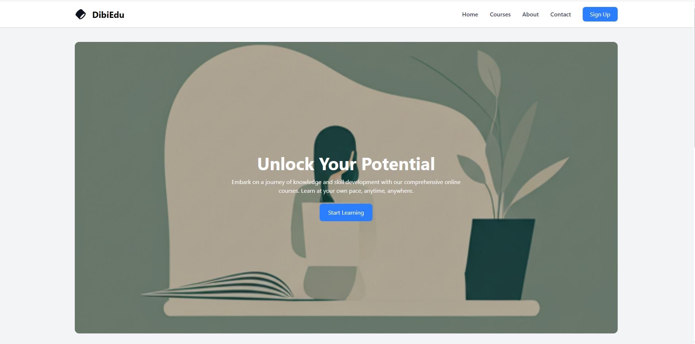

# 📚 DibiEdu — Learning Management System (LMS)

> Landing page statis untuk platform belajar online. Dibangun dengan **HTML5** dan **Tailwind CSS**.  
> Menampilkan daftar kursus unggulan, keunggulan platform, serta navigasi yang responsif.

## 📌 Tujuan Proyek

Menyediakan tampilan modern dan responsif untuk platform belajar online. Proyek ini cocok sebagai **portofolio front-end** dengan fokus pada desain yang bersih, komponen UI yang menarik, dan pengalaman pengguna yang optimal di berbagai perangkat.

## ✨ Fitur Utama

- ✅ Navbar responsif (desktop & mobile friendly)
- ✅ Hero section dengan latar belakang gambar & overlay
- ✅ Bagian "Why Choose EduLearn?" dengan 3 kartu keunggulan
- ✅ Featured Courses (3 kursus: Web Development, Advanced JavaScript, Responsive Design)
- ✅ Tombol "View All Courses"
- ✅ Footer dengan link kebijakan dan hak cipta
- ✅ Efek hover dan transisi halus
- ✅ Desain sepenuhnya menggunakan **Tailwind CSS** (utility-first)

## 🛠 Teknologi yang Digunakan

| Teknologi      | Fungsi |
|----------------|--------|
| HTML5          | Struktur halaman |
| Tailwind CSS   | Styling dan tata letak responsif (via `output.css`) |
| SQL (opsional) | Untuk manajemen data kursus (jika backend ditambahkan nanti) |

> **Catatan:** Proyek ini murni statis (front-end saja). File `output.css` adalah hasil kompilasi Tailwind. Jika ingin mengedit tema, instal Tailwind CLI dan jalankan build ulang.

## 🚀 Cara Menjalankan

1. **Clone repositori** ini:
   ```bash
   git clone https://github.com/username/dibiedu-lms.git
   
2. Buka folder proyek, lalu klik dua kali file index.html atau buka dengan browser pilihan Anda.

3. Pastikan semua aset (folder assets/ dan file output.css) berada di tempat yang benar.

## 🖼 Tampilan (Screenshot)


